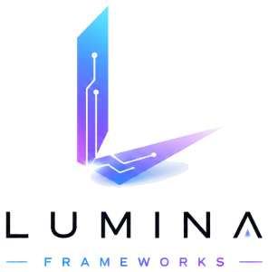

<p align="center">
  
</p>

<h1 align="center">Lumina Frameworks</h1>

<p align="center">
  <strong>Build smarter with AI</strong>
</p>

<p align="center">
  Official site for Lumina Frameworks: A Malaysia-based AI agency and training hub<br />
  helping businesses automate, scale, and ship with practical autonomous agents.
</p>

<p align="center">
  <a href="https://luminaframework.pages.dev"></a>
  <a href="https://lumina-frameworks.com"></a>
  <a href="https://t.me/+XZKbCeNqQs4zZjNl"></a>
</p>

<p align="center">
  
  
  
  
</p>

---

## Overview

This repository powers the **Lumina Frameworks** marketing site: a single-page experience with Swiss-precision layout, micro-interactions, a boot splash, and an embedded AI concierge named **Lumi**.

Visitors can explore engagement models, estimate automation ROI, browse courses, and reach the team, all from one crafted surface.

| Surface | Purpose |
| --- | --- |
| **Splash** | Boot sequence with theme-aware logo mark |
| **Hero** | Brand-first intro with CLI terminal accent |
| **Services** | DIY · DWY · DFY engagement paths |
| **ROI Calculator** | Estimate savings from workflow automation |
| **Courses** | Local LLMs, Hermes agents, agentic coding, and packs |
| **Portfolio** | Selected work (Write Genius, Lumina site craft) |
| **About / Contact** | Founders, mission, and lead capture |
| **Lumi** | On-site guide-bot via OpenRouter (key stays server-side) |

---

## Engagement models

```
DIY ¹  Do It Yourself     courses & templates     RM29 – RM399
DWY ²  Done With You      collaborative build     RM500 – RM2,000
DFY ³  Done For You       full AI department      RM2K – RM100K
```

### Courses & packs

| Offering | Price |
| --- | --- |
| Local LLM Setup | RM39 |
| AI Agent (Hermes) | RM49 |
| Agentic Coding | RM49 |
| Starter Pack | RM99 |
| Pro Pack | RM199 |
| Ultimate Pack | RM399 |

---

## Tech stack

| Layer | Choice |
| --- | --- |
| Frontend | Vanilla HTML, CSS, JS (`index.html`) |
| Design | Custom tokens, chamfered geometry, dark / light themes |
| Hosting | [Cloudflare Pages](https://pages.cloudflare.com/) |
| API | Pages Functions: `/api/chat`, `/api/contact` |
| LLM | OpenRouter (`deepseek/deepseek-v4-flash` by default) |
| Contact mail | Resend (branded HTML to Aliff + Amir) |
| Local dev | `chat-server.mjs` (static + chat/contact proxy on port `8788`) |

---

## Project structure

```
lumina-official-site/
├── public/                      # Everything served as static assets
│   ├── index.html               # Full site (UI, motion, chat client)
│   ├── projects.html            # Project archive (search / filter / sort)
│   ├── admin.html               # Admin console (Google sign-in required)
│   ├── 404.html                 # Branded not-found page
│   ├── _routes.json             # Only /api/* invokes Functions (keeps static free)
│   └── assets/                  # Logos, mascots, backdrops, project stills
├── chat-server.mjs              # Local static + chat/contact proxy (port 8788)
├── wrangler.toml                # Pages config + D1 / R2 bindings
├── package.json                 # Wrangler dev dependency + scripts
├── db/
│   ├── schema.sql               # D1 schema
│   └── seed.sql                 # The original 10 projects
├── tests/
│   ├── helpers/d1-sqlite.mjs    # D1-shaped shim over node:sqlite
│   ├── projects-auth.test.mjs   # Validation, sessions, allowlist, Lumi prompt
│   ├── api.test.mjs             # Route handlers vs real SQLite (no Wrangler)
│   ├── auth-google.test.mjs     # Google ID token verification, adversarially
│   ├── chat.test.mjs            # Chat proxy builds its prompt from D1
│   └── frontend.test.mjs        # Client-side escaping and URL guards
├── functions/
│   ├── _shared/
│   │   ├── auth.js              # Session cookie + Google ID token verification
│   │   ├── projects.js          # D1 access, row mapping, validation
│   │   ├── lumi-prompt.js       # Lumi system prompt (projects read from D1)
│   │   └── contact-email.js     # Branded HTML email template + Resend send
│   └── api/
│       ├── chat.js              # Production chat proxy
│       ├── contact.js           # Contact form → Aliff + Amir
│       ├── projects.js          # Public project feed
│       ├── auth/                # config · google · logout · me
│       └── admin/               # Projects CRUD + R2 image upload
└── .env.example                 # Env var template (safe to commit)
```

`pages_build_output_dir` points at `public/`, so server code, `db/`, and `tests/`
are never uploaded as static assets.

---

## Admin CMS

Projects live in D1 and are edited at `/admin.html`. Both the archive grid and
the home page carousel read from the same source, so publishing a project is one
form submit with no HTML edits.

| Endpoint | Auth | Purpose |
| --- | --- | --- |
| `GET /api/projects` | public | Published projects (`?featured=1` for the carousel) |
| `GET /api/auth/config` | public | Google client ID for the login button |
| `POST /api/auth/google` | public | Verifies an ID token, sets the session cookie |
| `POST /api/auth/logout` | public | Clears the session |
| `GET /api/auth/me` | public | Current session, or `{ authenticated: false }` |
| `GET/POST /api/admin/projects` | admin | List all / create |
| `PUT/DELETE /api/admin/projects/:slug` | admin | Update / unpublish (`?hard=1` to delete) |
| `POST /api/admin/upload` | admin | PNG/JPEG/WebP → R2 |

### How sign-in works

The browser gets a Google ID token via Google Identity Services and POSTs it to
`/api/auth/google`. The Function verifies the RS256 signature against Google's
JWKS, then checks `aud`, `iss`, `exp`, and `email_verified` before comparing the
address against `ADMIN_EMAILS`. Only then is a signed, `HttpOnly` session cookie
issued. There is no client secret to store or leak, and the allowlist is
re-checked on every request so revoking access is immediate.

### First-time Cloudflare setup

```bash
npx wrangler login
npx wrangler d1 create lumina-cms      # copy database_id into wrangler.toml
npx wrangler r2 bucket create lumina-media
npm run db:schema                       # apply schema (remote)
npm run db:seed                         # load the original 10 projects
```

Then in **Pages → Settings → Variables and Secrets**, add:

| Name | Type | Value |
| --- | --- | --- |
| `GOOGLE_CLIENT_ID` | plain | OAuth 2.0 Web client ID |
| `AUTH_SECRET` | secret | `node -e "console.log(require('crypto').randomBytes(48).toString('base64url'))"` |
| `ADMIN_EMAILS` | plain | `amirhafizi443@gmail.com,aliffprime3@gmail.com` |

In Google Cloud Console, add `https://lumina-frameworks.com` and
`http://127.0.0.1:8788` as **authorised JavaScript origins** on that client ID.

Finally, give the R2 bucket a custom domain (`media.lumina-frameworks.com`) so
uploaded images are served straight from Cloudflare's CDN.

---

## Quick start

### Prerequisites

- [Node.js](https://nodejs.org/) 18+
- Optional: [Wrangler](https://developers.cloudflare.com/workers/wrangler/) for Pages preview / deploy
- An [OpenRouter](https://openrouter.ai/) API key (for Lumi chat)

### 1. Clone

```bash
git clone https://github.com/Lumina-Frameworks/lumina-official-site.git
cd lumina-official-site
```

### 2. Configure secrets

```bash
cp .env.example .dev.vars
```

Edit `.dev.vars` (never commit this file):

```env
OPENROUTER_API_KEY=sk-or-...
OPENROUTER_MODEL=deepseek/deepseek-v4-flash
OPENROUTER_REASONING=medium
SITE_URL=https://lumina-frameworks.com
RESEND_API_KEY=re_...
CONTACT_FROM=Lumina Frameworks <hello@lumina-frameworks.com>
GOOGLE_CLIENT_ID=...apps.googleusercontent.com
AUTH_SECRET=<long random string>
ADMIN_EMAILS=amirhafizi443@gmail.com,aliffprime3@gmail.com
```

### 3. Run locally

There are two local servers, for two different jobs.

**CMS work** uses Wrangler, because it emulates D1 and R2:

```bash
npm install
npm run db:schema:local
npm run db:seed:local
npm run dev            # wrangler pages dev .
```

**Quick chat-only work** uses the lightweight Node server, which serves
`public/` and proxies chat and contact but has no database:

```bash
npm run dev:chat       # node chat-server.mjs
```

Either way, open **[http://127.0.0.1:8788](http://127.0.0.1:8788)**.

Without D1 the pages fall back to the project list baked into the HTML, so the
site still renders. `/api/contact` needs `RESEND_API_KEY` and only works
against production.

### 4. Tests

```bash
npm test               # node --test tests/
npm run test:direct    # same tests, run in-process (no child processes)
```

| File | Covers |
| --- | --- |
| `tests/projects-auth.test.mjs` | Input validation, URL/image injection guards, session signing, allowlist, Lumi's prompt |
| `tests/api.test.mjs` | The real route handlers against real SQLite: schema, seed, public feed, auth guard, CRUD, R2 upload |
| `tests/auth-google.test.mjs` | Google ID token verification: signature, `aud`/`iss`/`exp`, `alg:none` downgrade, attacker keys |
| `tests/chat.test.mjs` | That the chat proxy builds Lumi's prompt from D1 rather than the fallback list |
| `tests/frontend.test.mjs` | The public pages' client-side guards: `escapeHtml`, `safeUrl`, `safeImage`, payload normalisation |

`api.test.mjs` and `chat.test.mjs` are deliberately Wrangler-free. D1 is SQLite
and Node ships `node:sqlite`, so they apply the actual `db/schema.sql` and
`db/seed.sql` and drive the actual handlers with a small D1-shaped shim
(`tests/helpers/d1-sqlite.mjs`). That covers the SQL, the bind order, the column
names, and the auth guard without a Cloudflare account.

`auth-google.test.mjs` needs no Google account either: it generates its own RSA
keypair, serves it as the JWKS by stubbing `fetch`, and signs its own tokens so
the rejection paths can be tested properly.

What these do **not** cover: the live Google handshake against Google's real
keys, and real R2 behaviour.

> `npm test` spawns child processes and can be blocked by a restricted sandbox;
> `npm run test:direct` runs the same assertions in-process.

---

## Deploy (Cloudflare Pages)

This repo is configured as a Pages project (`wrangler.toml`):

```toml
name = "lumina-main-site-v4"
pages_build_output_dir = "./public"
```

**Production checklist**

1. Connect the GitHub repo to Cloudflare Pages (or deploy with Wrangler).
2. Apply the D1 schema and seed (see Admin CMS above).
3. Set environment variables in **Pages → Settings → Variables and Secrets**:
   - `OPENROUTER_API_KEY` (secret)
   - `RESEND_API_KEY` (secret)
   - `GOOGLE_CLIENT_ID`
   - `AUTH_SECRET` (secret)
   - `ADMIN_EMAILS`
   - `OPENROUTER_MODEL` (optional)
   - `OPENROUTER_REASONING` (optional)
   - `SITE_URL`
   - `CONTACT_FROM` (verified Resend sender, e.g. `Lumina Frameworks <hello@lumina-frameworks.com>`)
4. Deploy. Routes land under `/api/`.

Verify your domain in [Resend](https://resend.com) so mail can send from `@lumina-frameworks.com` to Aliff and Amir.

```bash
npx wrangler pages deploy public --project-name=lumina-main-site-v4
```

> Deploy `public/`, never `.`. Passing `.` uploads the repo root and re-exposes
> `wrangler.toml`, `chat-server.mjs`, `db/`, and `tests/` as public files, which
> is exactly the leak the `public/` restructure fixed. `npm run deploy` is the
> safer shorthand: it relies on `pages_build_output_dir` in `wrangler.toml`.

---

## Lumi (guide-bot)

Lumi is the on-site concierge: sharp, practical, and scoped to Lumina services, courses, ROI fit, and contact paths.

| Environment | Entry |
| --- | --- |
| Production | `functions/api/chat.js` |
| Local | `chat-server.mjs` → `/api/chat` |

Both keep the OpenRouter key **server-side**, stream replies, and share the same system prompt (identity, pricing bands, founders, and guardrails).

---

## Brand notes

| Token | Role |
| --- | --- |
| `#1aa3ff` / `#0d6fd4` | Accent blue (dark / light) |
| `#7dd9ff` | Signal cyan |
| `#05060a` | Dark canvas |
| `#eef3f8` | Light canvas |
| Syne · Chakra Petch · Outfit · IBM Plex Mono | Display / hero / body / mono |

Visual language: geometric frames, chamfered clips, grain overlays, neural canvas motion, and theme-aware logos, not dashboard clutter.

---

## Team

| | |
| --- | --- |
| **Aliff Ros** | Co-Founder, Business & Marketing · [Arefaros](https://github.com/Arefaros) |
| **Amir** | Co-Founder, Tech & Development · [YoRzHe-HotaaRu](https://github.com/YoRzHe-HotaaRu) |

Based in Malaysia · replies within 24 hours · [Join Us for Free](https://t.me/+XZKbCeNqQs4zZjNl)

---

## License

Private repository for Lumina Frameworks. All rights reserved unless otherwise noted.

---

<p align="center">
  <sub>Lumina Frameworks · Build smarter with AI</sub>
</p>
