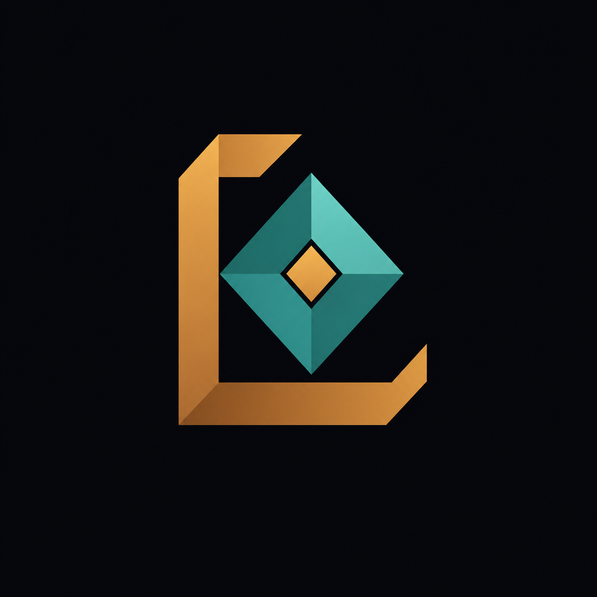

<p align="center">
  
</p>

<h1 align="center">Lumina Frameworks</h1>

<p align="center">
  <strong>Build smarter with AI</strong>
</p>

<p align="center">
  Official site for Lumina Frameworks: a Malaysia-based AI agency and training hub<br />
  helping businesses automate, scale, and ship with practical autonomous agents.
</p>

<p align="center">
  <a href="https://luminaframeworks.pages.dev"></a>
  <a href="https://luminaframeworks.com"></a>
  <a href="https://t.me/luminaframeworks"></a>
</p>

<p align="center">
  
  
  
  
</p>

---

## Overview

This repository powers the **Lumina Frameworks** marketing site: a single-page experience with Swiss-precision layout, micro-interactions, and an embedded AI concierge named **Lumi**.

Visitors can explore engagement models, estimate automation ROI, browse courses, and reach the team, all from one crafted surface.

| Surface | Purpose |
| --- | --- |
| **Hero** | Brand-first intro with live system status and CLI-style accent |
| **Services** | DIY · DWY · DFY engagement paths |
| **ROI Calculator** | Estimate savings from workflow automation |
| **Courses** | Local LLMs, Hermes agents, agentic coding, and packs |
| **Portfolio** | Selected work (Write Genius, Lumina site craft) |
| **About / Contact** | Founders, mission, and lead capture |
| **Lumi** | On-site guide-bot via OpenRouter (key stays server-side) |

---

## Engagement models

```
DIY ¹  Do It Yourself     courses & templates     RM29 – RM399
DWY ²  Done With You      collaborative build     RM500 – RM2,000
DFY ³  Done For You       full AI department      RM2K – RM100K
```

---

## Tech stack

| Layer | Choice |
| --- | --- |
| Frontend | Vanilla HTML, CSS, JS (`index.html`) |
| Design | Custom tokens, chamfered geometry, dark / light themes |
| Hosting | [Cloudflare Pages](https://pages.cloudflare.com/) |
| API | Pages Function at `functions/api/chat.js` |
| LLM | OpenRouter (`deepseek/deepseek-v4-flash` by default) |
| Local dev | `chat-server.mjs` (static + chat proxy on port `8788`) |

---

## Project structure

```
lumina-official-site/
├── index.html              # Full site (UI, motion, chat client)
├── chat-server.mjs         # Local static + OpenRouter proxy
├── wrangler.toml           # Cloudflare Pages project config
├── .env.example            # Env var template (safe to commit)
├── functions/
│   └── api/
│       └── chat.js         # Production chat proxy (Pages Function)
└── assets/
    ├── lumina-logo.png
    ├── mascot-*.png        # Lumi expressions
    ├── hero-backdrop*.png
    └── project-*.png       # Portfolio stills
```

---

## Quick start

### Prerequisites

- [Node.js](https://nodejs.org/) 18+
- Optional: [Wrangler](https://developers.cloudflare.com/workers/wrangler/) for Pages preview / deploy
- An [OpenRouter](https://openrouter.ai/) API key (for Lumi chat)

### 1. Clone

```bash
git clone https://github.com/Lumina-Frameworks/lumina-official-site.git
cd lumina-official-site
```

### 2. Configure secrets

```bash
cp .env.example .dev.vars
```

Edit `.dev.vars` (never commit this file):

```env
OPENROUTER_API_KEY=sk-or-...
OPENROUTER_MODEL=deepseek/deepseek-v4-flash
OPENROUTER_REASONING=medium
SITE_URL=https://luminaframeworks.pages.dev
```

### 3. Run locally

```bash
node chat-server.mjs
```

Open **[http://127.0.0.1:8788](http://127.0.0.1:8788)**.

The local server serves static files and proxies `POST /api/chat` to OpenRouter with the same system prompt used in production.

> Static-only preview: open `index.html` in a browser. Chat will fail without the proxy and API key.

---

## Deploy (Cloudflare Pages)

This repo is configured as a Pages project (`wrangler.toml`):

```toml
name = "lumina-main-site-v4"
pages_build_output_dir = "."
```

**Production checklist**

1. Connect the GitHub repo to Cloudflare Pages (or deploy with Wrangler).
2. Set environment variables in **Pages → Settings → Environment variables**:
   - `OPENROUTER_API_KEY` (secret)
   - `OPENROUTER_MODEL` (optional)
   - `OPENROUTER_REASONING` (optional)
   - `SITE_URL`
3. Deploy. The chat route lands at `/api/chat`.

```bash
npx wrangler pages deploy . --project-name=lumina-main-site-v4
```

---

## Lumi (guide-bot)

Lumi is the on-site concierge: sharp, practical, and scoped to Lumina services, courses, ROI fit, and contact paths.

| Environment | Entry |
| --- | --- |
| Production | `functions/api/chat.js` |
| Local | `chat-server.mjs` → `/api/chat` |

Both keep the OpenRouter key **server-side**, stream replies, and share the same system prompt (identity, pricing bands, founders, and guardrails).

---

## Brand notes

| Token | Role |
| --- | --- |
| `#d4a056` | Accent gold |
| `#3a9e94` / `#7ec8bf` | Teal signal |
| `#0b0d11` | Dark canvas |
| Syne · Chakra Petch · Outfit · IBM Plex Mono | Display / hero / body / mono |

Visual language: geometric frames, chamfered clips, grain overlays, and intentional motion, not dashboard clutter.

---

## Team

| | |
| --- | --- |
| **Aliff Ros** | Co-Founder, Business & Marketing · [Arefaros](https://github.com/Arefaros) |
| **Amir** | Co-Founder, Tech & Development · [YoRzHe-HotaaRu](https://github.com/YoRzHe-HotaaRu) |

Based in Malaysia · replies within 24 hours · [Telegram](https://t.me/luminaframeworks)

---

## License

Private repository for Lumina Frameworks. All rights reserved unless otherwise noted.

---

<p align="center">
  <sub>Lumina Frameworks · Build smarter with AI</sub>
</p>
